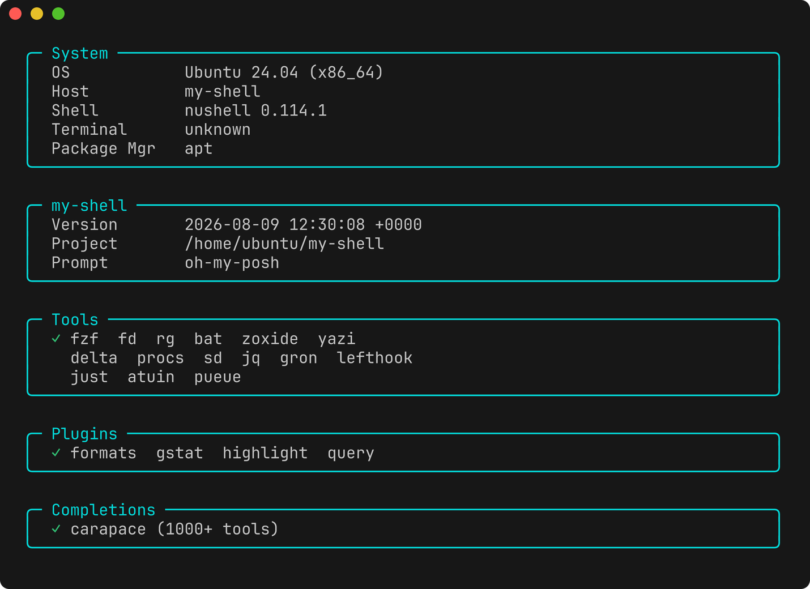
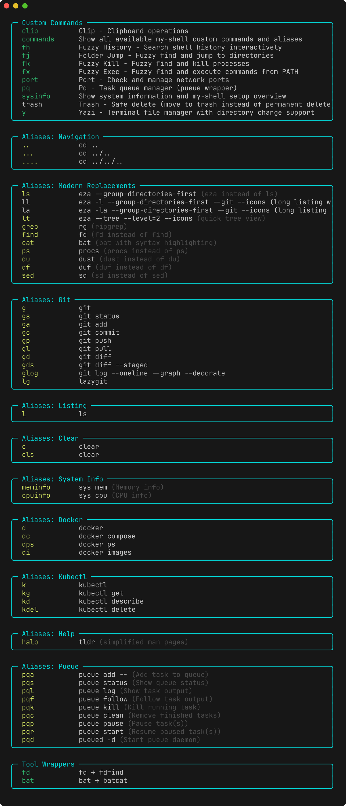

# my-shell

[](https://github.com/el-f/my-shell/actions/workflows/test.yml)

One TOML config, rendered to [Nushell](https://www.nushell.sh/) and [xonsh](https://xon.sh/), deployed on Linux, macOS and Windows.



<sub>Rendered by `docker/Dockerfile.screenshots`.</sub>

## Install

Needs `git` already installed; the installers stop without it.

**Linux / macOS**

```bash
curl -sSf https://raw.githubusercontent.com/el-f/my-shell/main/install.sh | sh
```

**Windows (PowerShell)**

```powershell
irm https://raw.githubusercontent.com/el-f/my-shell/main/install.ps1 | iex
```

It clones to `~/.local/share/my-shell` (`%LOCALAPPDATA%\my-shell` on Windows); set
`MY_SHELL_INSTALL_DIR` to change that. It installs `uv`, `mise`, the shells and the tools below,
**overwrites `config.nu` and `env.nu`**, and installs a Nerd Font for the prompt icons. When xonsh
is enabled, it also overwrites `~/.xonshrc`.
The files it replaces are copied to `.my-shell-backup/` first — `my-shell rollback` restores them.

xonsh is only installed when `[shells] xonsh = true` in `config/settings.toml` or you pass
`--install-xonsh`. Nothing outside your shell config is touched unless you set
`[git] manage_global_config = true` (see [Git pager](#git-pager-delta)).

> Tool versions resolve through the GitHub API, which rate-limits anonymous callers. If you hit it:
> ```bash
> export GITHUB_TOKEN=$(gh auth token)
> ```

Then start `nu`.

### Running the CLI

It is not on your PATH. Run it from the install directory:

```bash
cd ~/.local/share/my-shell        # Windows: cd $env:LOCALAPPDATA\my-shell
uv run my-shell doctor
```

Every `my-shell <command>` below means that.

`MY_SHELL_REPO` and `MY_SHELL_BRANCH` select an alternate installer source. `MY_SHELL_DIR`
overrides CLI repo-root detection; set it only when intentionally targeting a different checkout.

### Make Nushell the terminal default on macOS

Oh-My-Posh loads automatically from the deployed Nushell config. Set the command used by each app
to `/opt/homebrew/bin/nu -l` (Intel Homebrew: `/usr/local/bin/nu -l`):

- Terminal: Settings → Profiles → Shell → Run command.
- iTerm2: Settings → Profiles → General → Command, then make that profile the default.
- VS Code: add a Nushell profile under `terminal.integrated.profiles.osx` and select it with
  `terminal.integrated.defaultProfile.osx`.

Installing a font does not change existing app profiles. Select `MesloLGM Nerd Font Mono` in each
terminal profile; for VS Code set `terminal.integrated.fontFamily` to that exact family name.

## Updating

```bash
uv run my-shell update
```

`update` pulls with `--ff-only` and re-deploys the shells enabled in settings. Run `mise install --locked` afterwards for new
tool versions. `setup` and `deploy` skip the write when nothing changed; `--force` writes anyway.

## Config

| File | Holds |
| --- | --- |
| [`aliases.toml`](config/aliases.toml) | Aliases, per-shell overrides, wrapper commands |
| [`plugins.toml`](config/plugins.toml) | Nushell plugins to install |
| [`settings.toml`](config/settings.toml) | Shells, prompt theme, integrations, command groups, fonts, backups, git |
| [`profiles.toml`](config/profiles.toml) | Named subsets of integrations and command groups |

`render` turns those into `shells/nushell/aliases.nu` and `shells/xonsh/aliases.xsh` (git-ignored).
`deploy` writes the shell config files, generates one init file per enabled integration, and records
a hash so the next deploy can skip unchanged work. `setup` does both, installing shells and tools first.

Deployed config is three layers, in load order:

| Layer | What it holds | Files | Replaced on update? |
| --- | --- | --- | --- |
| 1. Base template | Shell settings, PATH, env vars | `config.nu`, `env.nu`, `~/.xonshrc` | Yes |
| 2. my-shell | Aliases, custom commands, integrations | same files | Yes |
| 3. Yours | Anything you write | `user-custom.nu`, `user-env.nu`, `user-custom.xsh` | No |

Layer 3 is created on first deploy and never rewritten. It loads last, so it wins.

For Nushell each integration gets its own generated init file; a missing tool produces a stub
instead of changing the shape of `config.nu`. xonsh keeps its integrations inline in `~/.xonshrc`.

## CLI

| Command | What it does |
| --- | --- |
| `setup` | Install shells and tools, render aliases, deploy configs |
| `install` | Install shell binaries only |
| `render` | Render the alias files only |
| `deploy` | Deploy configs only |
| `update` | Pull, then re-deploy both shells |
| `status` | Deployed version vs current |
| `doctor` | Health checks. `--fix` installs what is missing |
| `rollback` | Restore a config backup |
| `uninstall` | Remove the deployed config files, keeping your layer 3 ones |
| `install-tools` | Install tools through your system package manager |
| `install-fonts` | Install a Nerd Font (`meslo` or `firacode`) |
| `detect` | Print OS, package manager and detected tools |
| `benchmark` | Measure shell startup time |
| `validate` | Check `config/*.toml` for errors |
| `config` | Print the merged settings |
| `version` | Version and deployment status |
| `init` | Interactive setup wizard |
| `plugins` | `install`, `register`, `status`, `setup` |
| `profiles` | `list`, `apply <name>` |

`--shell nushell|xonsh|all` narrows any command that touches a shell, `--verbose/-v` turns on debug
output, and `--help` on any command covers the rest.

## Custom commands

Written for both shells. Enable or disable by group in `[commands]` in `config/settings.toml`.

| Command | What it does |
| --- | --- |
| `commands` | List every my-shell alias and custom command, grouped |
| `fj [dir]` | Fuzzy directory jump through `fd` + `fzf` |
| `y [dir]` | Open [yazi](https://github.com/sxyazi/yazi), then `cd` to where you quit |
| `fx` | Pick an executable from PATH through `fzf` and run it |
| `fh` | Search shell history — atuin's UI when installed, otherwise `fzf` |
| `fk` | Pick a process through `fzf` and kill it |
| `port <n>` | Show what holds a port. `-k` kills it, `--list/-l` lists all listening |
| `clip` | Pipe in to copy, run bare to paste |
| `trash <file...>` | Move to the recycle bin instead of deleting |
| `pq <args...>` | [pueue](https://github.com/Nukesor/pueue), starting the daemon if needed |
| `sysinfo` | System, tool, plugin and completion overview |

`commands` prints every one of them next to the aliases, grouped:



## Aliases

Every alias sits under a section in [`config/aliases.toml`](config/aliases.toml). A value is a plain
string, a table with per-shell overrides, or a wrapper that falls back to a second binary.

```toml
[git]
g = "git"
lg = "lazygit"

[modern_replacements]
grep = { command = "rg", comment = "ripgrep" }

[help]
halp = { command = "tldr", comment = "simplified man pages" }

[system_info]
meminfo = { nushell = "sys mem", xonsh_fn = "platform_meminfo" }

[wrappers.fd]
preferred = "fd"
fallback = "fdfind"
error = "fd not found (install fd or fd-find)"
```

`wrappers` is the one reserved section name. The tldr alias is `halp` because `help` is a builtin in
both shells. Add your own in `config/aliases.local.toml` (git-ignored, merged on top).

## Integrations

On by default, toggled in `[integrations]` in `config/settings.toml`:
[carapace](https://carapace.sh/) completions, [atuin](https://atuin.sh/) history,
[mise](https://mise.jdx.dev/) tool versions, [oh-my-posh](https://github.com/JanDeDobbeleer/oh-my-posh)
prompt, and [zoxide](https://github.com/ajeetdsouza/zoxide).

An integration can also load on the first prompt instead of at startup:

```toml
[integrations]
zoxide = { enabled = true, defer = true }
```

`defer` works in xonsh only. Nushell runs `source` at parse time, so a deferred load could never
export its commands -- Nushell ignores the flag and says so in the generated config.

The prompt theme is set in `config/settings.toml`:

```toml
[oh-my-posh]
theme = "jblab_2021"
```

Themes live in `shells/shared/oh-my-posh/themes/` (see
[THEMES.md](shells/shared/oh-my-posh/themes/THEMES.md) for the bundled one's origin and licence).
More at <https://ohmyposh.dev/docs/themes>.

### Git pager (delta)

With `[git] manage_global_config = true` **and** [delta](https://github.com/dandavison/delta)
installed, `setup` writes five keys to your global `~/.gitconfig`:

```
core.pager                delta
interactive.diffFilter    delta --color-only
delta.navigate            true
delta.side-by-side        true
merge.conflictStyle       zdiff3
```

Default is `false`. `uninstall` does not undo them — use `git config --global --unset <key>`.

## Plugins (Nushell)

Native Rust commands, listed in [`config/plugins.toml`](config/plugins.toml), built with `cargo`:

```bash
uv run my-shell plugins setup
```

> Needs a current Rust toolchain; the first build takes a few minutes. Plugins are optional.
> A plugin crate often needs a newer `rustc` than the one you have — run `rustup update` first.

| Plugin | What it adds |
| --- | --- |
| `nu_plugin_gstat` | `gstat` — git status as a Nushell record |
| `nu_plugin_formats` | `from` / `to` converters for eml, ics, ini, vcf |
| `nu_plugin_query` | `query json` (jmespath), `query xml` (xpath), `query web` (CSS) |

Add your own in `config/plugins.local.toml`, for example `nu_plugin_highlight` for syntax
highlighting in a pipeline.

A plugin binary is built against one Nushell minor version and stops loading when Nushell
moves on. `doctor` reports that, and `plugins setup` rebuilds the stale ones.

## Profiles

A named subset of integrations and command groups, in
[`config/profiles.toml`](config/profiles.toml). `minimal` keeps zoxide plus the navigation and
utility commands; `full` turns everything on.

```bash
uv run my-shell profiles apply minimal
uv run my-shell setup --profile minimal   # apply and deploy together
```

Applying one writes `config/settings.local.toml`.

## Customization

Layer 3 files, created on first deploy and never rewritten:

| File | Where |
| --- | --- |
| `user-custom.nu`, `user-env.nu` | Linux `~/.config/nushell/` · macOS `~/Library/Application Support/nushell/` · Windows `%APPDATA%\nushell\` |
| `user-custom.xsh` | Linux/macOS `~/.config/xonsh/` · Windows `%APPDATA%\xonsh\` |

`XDG_CONFIG_HOME` overrides the Linux and macOS paths.

```nushell
# user-custom.nu
alias repos = cd ~/repos
$env.config.show_banner = false
```

For config, create a `.local.toml` beside the tracked file — `aliases.local.toml`,
`plugins.local.toml` or `settings.local.toml`. All are git-ignored and merged on top by the command
that reads them.

## Tools

Installed by `mise install` from [`mise.toml`](mise.toml), except eza: the mise backend used here did
not provide a working macOS executable, so `my-shell setup` / `my-shell install-tools eza` uses the
platform package manager.

| Tool | What it is | Aliased as |
| --- | --- | --- |
| [fzf](https://github.com/junegunn/fzf) | Fuzzy finder; drives `fj`, `fx`, `fh`, `fk` | |
| [fd](https://github.com/sharkdp/fd) | Faster `find` | `find` |
| [ripgrep](https://github.com/BurntSushi/ripgrep) | Faster `grep`, respects `.gitignore` | `grep` |
| [bat](https://github.com/sharkdp/bat) | `cat` with highlighting; the fzf preview | `cat` |
| [eza](https://github.com/eza-community/eza) | `ls` with git status and icons (installed outside mise) | `ls`, `ll`, `la`, `lt` |
| [zoxide](https://github.com/ajeetdsouza/zoxide) | Directory jumper | `cd`, `cdi` |
| [yazi](https://github.com/sxyazi/yazi) | Terminal file manager; the `y` command | |
| [oh-my-posh](https://github.com/JanDeDobbeleer/oh-my-posh) | Prompt theme engine | |
| [carapace](https://github.com/carapace-sh/carapace-bin) | Tab completions | |
| [atuin](https://github.com/atuinsh/atuin) | Shell history in SQLite | |
| [delta](https://github.com/dandavison/delta) | Syntax-highlighted git diffs | |
| [procs](https://github.com/dalance/procs) | `ps` with colour and tree view | `ps` |
| [sd](https://github.com/chmln/sd) | `sed`-style replace without the escaping | `sed` |
| [dust](https://github.com/bootandy/dust) | `du` with a readable tree | `du` |
| [duf](https://github.com/muesli/duf) | `df` with a readable table | `df` |
| [lazygit](https://github.com/jesseduffield/lazygit) | Terminal UI for git | `lg` |
| [tlrc](https://github.com/tldr-pages/tlrc) | [tldr pages](https://tldr.sh/) client | `halp` |
| [jq](https://github.com/jqlang/jq) | JSON processor | |
| [gron](https://github.com/tomnomnom/gron) | Flattens JSON into greppable lines | |
| [pueue](https://github.com/Nukesor/pueue) | Task queue; the `pq` command | `pqa`, `pqs`, ... |
| [just](https://github.com/casey/just) | Command runner | |
| [lefthook](https://github.com/evilmartians/lefthook) | Git hooks manager | |

`my-shell install-tools` covers a subset through your system package manager instead;
`--dry-run` prints the exact command per platform.

## Development

```bash
git clone https://github.com/el-f/my-shell
cd my-shell
mise trust
mise install --locked
```

| Task | Runs |
| --- | --- |
| `mise test` | `pytest` |
| `mise lint` | `ruff check core/ tests/` |
| `mise format` | `ruff format core/ tests/` |
| `mise check` | lint, format check, mypy, fast tests |
| `mise ci` | `check` plus `uv lock --check`, `uv build` and every test except `slow` |
| `mise mutation` | `mutmut` over changed `core/*.py` (no native Windows build) |
| `mise setup` | `uv sync --frozen`, then `my-shell setup` |
| `mise render` | `my-shell render` |
| `mise install-shells` | `my-shell install` |

More: [tests](tests/README.md) · [Docker](docker/README.md) · [core engine](core/README.md).

## Troubleshooting

| Symptom | Try |
| --- | --- |
| Config did not change after an update | `my-shell setup --force` |
| Completions or a tool look broken | `my-shell doctor --fix` |
| Prompt shows boxes instead of icons | `my-shell install-fonts`, restart the terminal, select the font |
| Want your old config back | `my-shell rollback` — shows a diff and asks first |

## License

[MIT](LICENSE). The bundled oh-my-posh theme keeps its own copyright and licence — see
[THEMES.md](shells/shared/oh-my-posh/themes/THEMES.md).
